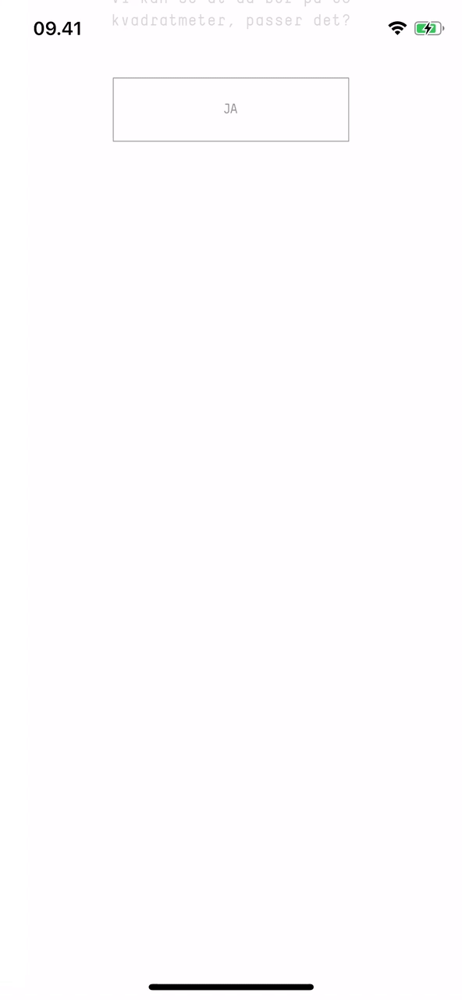

# Hacking session

The task is to create an input component for residents of a household: Spouse, roommates, and children.

- [ ] Create a file structure that you think makes sense
- [ ] Implement functionality to enter the information
- [ ] Add some styling
- [ ] Add some animation

We are not looking for a finished and polished product, but just to see how you work and to hear your reasoning about your choices.

